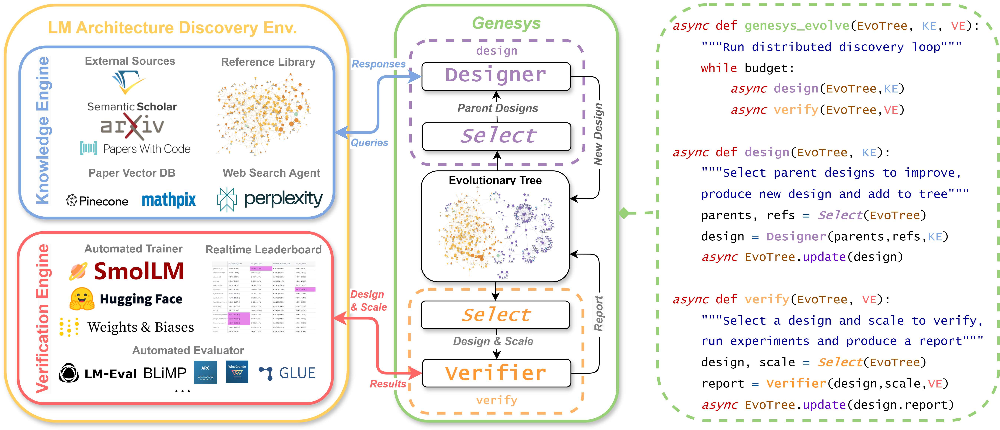

<div align="center">
  
  <br>
  <br>
  <h1>🧬 Genesys: Language Modeling by Language Models</h1>
</div>

<p align="center">
  <a href="https://github.com/allenai/genesys/blob/main/LICENSE">
    
  </a>
  <a href="https://github.com/allenai/genesys/releases">
    
  </a>
  <a href="https://arxiv.org/pdf/2506.20249.pdf">
    
  </a>
  <a href="https://genesys.allen.ai">
    
  </a>
    <a href="//www.youtube.com/watch?v=YHBpzImL0vM" target="_blank">
        
    </a>
</p>

**Genesys** (**Gene**tic discovery **sys**tem) is a distributed evolutionary system that uses LLM agents to discover better LLMs. 
It covers the full workflow from ideation, implementation, checking, training, and evaluating.
You can play with the demo at [genesys.allen.ai](https://genesys.allen.ai) (may slow for first build).
Our results can be found in these pages:
 - Evolution statistics: Evolve - Evolution Statistics
 - Discovered Designs: Viewer - Design Artifacts (you can download them here)
 - Design Leaderboard: Viewer - Design Leaderboard
 
There are many other features from the GUI, you can explore them. Here is a [short demo video](https://drive.google.com/file/d/1JG0hNAJuaPZWUKfwrwoF_ufh0GJuLO7z/view?usp=sharing) that briefly show some of the features.


# Installation

1. Clone the repo, assume its under your home directory `~`

2. Create a virtual env with pytorch, move to the repo, and install genesys cli
```shell
conda create -n genesys python=3.12 -y && \
conda activate genesys && \
cd ~/genesys && \
conda install pytorch==2.4.1 torchvision==0.19.1 torchaudio==2.4.1 pytorch-cuda=11.8 -c pytorch -c nvidia -y && \
pip install -e .
```

3. Setup Environment
```shell
export MY_OPENAI_KEY=YOURKEY
export TOGETHER_API_KEY=YOURKEY
export ANTHROPIC_API_KEY=YOURKEY
export HF_KEY=YOURKEY
export WANDB_API_KEY=YOURKEY
export S2_API_KEY=YOURKEY
export DATA_DIR=~/genesys/data # change it to a directory you like
export CKPT_DIR=~/genesys/ckpt # change it to a directory you like
export DB_KEY_PATH=~/genesys/secrets/db_key.json # provide yours, see item 4 below
export HF_DATASETS_TRUST_REMOTE_CODE=1
export PINECONE_API_KEY=YOURKEY
export COHERE_API_KEY=YOURKEY
export PERPLEXITY_API_KEY=YOURKEY
export MATHPIX_API_ID=YOURKEY # optional, it provides pdf to text service, useful if you need to get paper from arxiv url for example, its not used in the paper but you may try it yourself
```

4. Setup a firebase backend, and store the secret json in DB_KEY_PATH, this is **required** for the distributed evolution

5. Setup a pinecone vectorstore (**optional**, if you want to use the vector search of paper chunks). You need to store the chunks in your vectorstore, refer to the code in [search_utils.py](https://github.com/allenai/genesys/blob/main/model_discovery/agents/search_utils.py)).

6. Setup the requirements
```shell
genesys setup && \ 
pip install -r requirements_optional.txt # optional
```
<!-- Hint 1: If you want to prepare the datasets only, use `genesys setup -d`. 

Hint 2: You can simply install requirements by `genesys setup -s` as preparing datasets takes a long time. -->

7. Test your setup by launching a node
```shell
genesys node
```

8. Launch the gui
```shell
genesys gui
```


<!-- 
### Build search library

Download `library_files.zip`[] , unzip it and put it under `model/library`. It should be like this: 
```
model/
    library/
        files/
            htmls/
            htmls2/
            htmlsp/
            pdfs/
            pdfs2/
            pdfsp/
```
 -->

## Verification Engine


It should be setup if you followed the installation instruction, but if not, here is how you can separately set it up.

The training corpus is available in [smollm-12.5-corpus](https://huggingface.co/datasets/chengjunyan1/smollm-12.5-corpus).
The evaluation is based on a [custmoized lm_eval](https://github.com/chengjunyan1/lm-evaluation-harness/tree/main). You must export DATA_DIR first, then download evaluation data in DATA_DIR, e.g.:
```
{DATA_DIR}/blimp_filtered/adjunct_island.jsonl
```
Download the [babyLM evaluation data](https://files.osf.io/v1/resources/ad7qg/providers/osfstorage/66358ec34664da20a0ed6acc/?zip=evaluation_data). Notice that if you change your DATA_DIR, you may need to reinstall it, and remember DO NOT INSTALL peft which may cause conflicts. The supported tasks can be found in: https://github.com/EleutherAI/lm-evaluation-harness/tree/main/lm_eval/tasks, specially, it contains babyLM tasks in "blimp_filtered" and "blimp_supplement".


## Hints for Evolution

Better separate the design nodes and verification nodes, design checkers need to use GPUs, so may cause conflicts. It is recommended to deploy few design nodes and many verification nodes as design nodes are mostly bounded by CPU and API rate limits. 


## Citing

```bibtex
@misc{cheng2025languagemodelinglanguagemodels,
      title={Language Modeling by Language Models}, 
      author={Junyan Cheng and Peter Clark and Kyle Richardson},
      year={2025},
      eprint={2506.20249},
      archivePrefix={arXiv},
      primaryClass={cs.AI},
      url={https://arxiv.org/abs/2506.20249}, 
}
```


<!-- 
### create beaker image (ai2 internal) 
You can run 
```
sh create_beaker.sh 
```
to create a beaker image that allows you to run beaker batch jobs. You
can run a batch job by doing the following: 
```bash 
beaker experiment create etc/beaker/train_example.yaml

```
which shows how to use the built image in beaker to run an example
training job. 

# Current discovery system 

To build a discovery system, you can do the following: 
```python
from model_discovery import BuildSystem 


system = BuildSystem() 
system("discovery me a new model") 
```
The implementation is in `model_discovery/system.py`, which loads a `designer` and `reviewer` agent (by default) from the agent specification files in `etc/agent_spec` (this can be modified as needed and additional agents can be added). 


# Model Discovery Algorithm

Assumptions:
1. Cost of verification >> sampling where in the sampling process, the cost of implementation > proposal
2. The verification process can asymptotically reflect the distance to the optimum or alternatively the improvements
3. High-quality samples (designs chosen to verify) can increase the convergence of the evolution process
4. LLM thinking depth correlated to total output lengths in a dialog for producing one sample
5. LLM agent can asymptotically produce a high-quality sample after a dialog with probability p
...
-->
